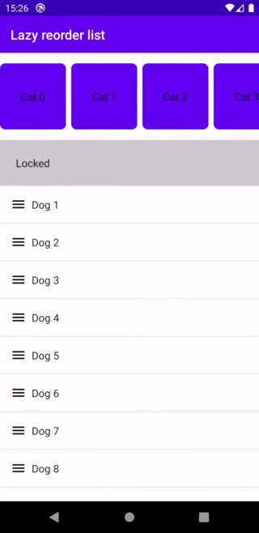

# Compose LazyList/Grid reorder
[](https://github.com/aclassen/ComposeReorderable/releases/latest)

A Jetpack Compose (Android + Desktop) modifier enabling reordering by drag and drop in a LazyList and LazyGrid.

Forked from https://github.com/aclassen/ComposeReorderable.

Changes made to include a way to locked items from being draggable.
```kotlin
@Composable
fun VerticalReorderList() {
    val data = remember { mutableStateOf(List(100) { "Item $it" }) }
    val state = rememberReorderableLazyListState(
        canDragOver = { itemPosition ->
            if (list[itemPosition.index].canDrag) {
                true
            } else {
                false
            }
        },
        ...
    }
})
```

Modified publishing script to publish changes to GitHub Packages.



## Download

```
dependencies {
    implementation("org.burnoutcrew.composereorderable:reorderable:<latest_version>")
}
```

## How to use

- Create a reorderable state by  `rememberReorderableLazyListState` for LazyList or `rememberReorderableLazyGridState` for LazyGrid
- Add the `reorderable(state)` modifier to your list/grid
- Inside the list/grid itemscope create a `ReorderableItem(state, key = )` for a keyed lists or `ReorderableItem(state, index = )` for a indexed only list. (Animated items only work with keyed lists)
- Apply the `detectReorderAfterLongPress(state)` or `detectReorder(state)` modifier to the list.
If only a drag handle is needed apply the detect modifier to any child composable inside the item layout.

`ReorderableItem` provides the item dragging state, use this to apply elevation , scale etc.

```kotlin
@Composable
fun VerticalReorderList() {
    val data = remember { mutableStateOf(List(100) { "Item $it" }) }
    val state = rememberReorderableLazyListState(onMove = { from, to ->
        data.value = data.value.toMutableList().apply {
            add(to.index, removeAt(from.index))
        }
    })
    LazyColumn(
        state = state.listState,
        modifier = Modifier
        .reorderable(state)
        .detectReorderAfterLongPress(state)
    ) {
        items(data.value, { it }) { item ->
            ReorderableItem(state, key = item) { isDragging ->
                val elevation = animateDpAsState(if (isDragging) 16.dp else 0.dp)
                Column(
                    modifier = Modifier
                        .shadow(elevation.value)
                        .background(MaterialTheme.colors.surface)
                ) {
                    Text(item)
                }
            }
        }
    }
}

```
The item placement and drag cancelled animation can be changed or disabled by `dragCancelledAnimation` and `defaultDraggingModifier`

```kotlin
@Composable
fun VerticalReorderGrid() {
    val data = remember { mutableStateOf(List(100) { "Item $it" }) }
    val state = rememberReorderableLazyGridState(dragCancelledAnimation = NoDragCancelledAnimation(),
        onMove = { from, to ->
            data.value = data.value.toMutableList().apply {
                add(to.index, removeAt(from.index))
            }
        })
    LazyVerticalGrid(
        columns = GridCells.Fixed(4),
        state = state.gridState,
        modifier = Modifier.reorderable(state)
    ) {
        items(data.value, { it }) { item ->
            ReorderableItem(state, key = item, defaultDraggingModifier = Modifier) { isDragging ->
                Box(
                    modifier = Modifier
                        .aspectRatio(1f)
                        .background(MaterialTheme.colors.surface)
                ) {
                    Text(text = item,
                         modifier = Modifier.detectReorderAfterLongPress(state)
                    )
                }
            }
        }
    }
}
```

Check out the sample app for different implementation samples.

## Notes

It's a known issue that the first visible item does not animate. 

## License

```
Copyright 2022 Teo Boon Keat
Copyright 2022 André Claßen

Licensed under the Apache License, Version 2.0 (the "License");
you may not use this file except in compliance with the License.
You may obtain a copy of the License at

    https://www.apache.org/licenses/LICENSE-2.0

Unless required by applicable law or agreed to in writing, software
distributed under the License is distributed on an "AS IS" BASIS,
WITHOUT WARRANTIES OR CONDITIONS OF ANY KIND, either express or implied.
See the License for the specific language governing permissions and
limitations under the License.
```
